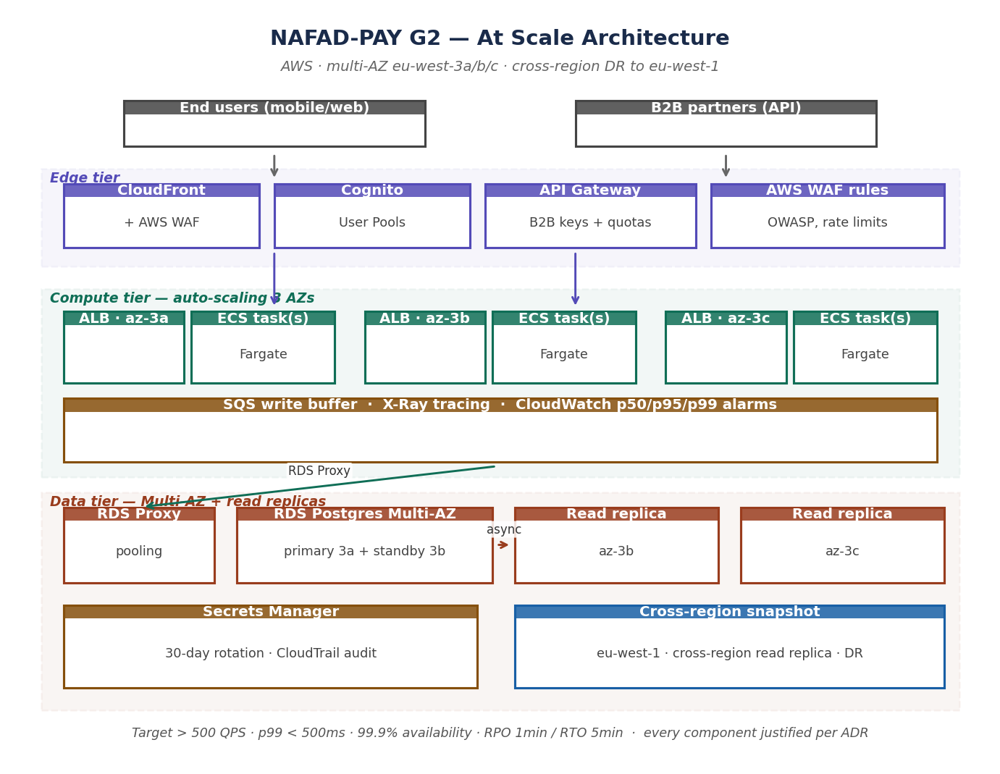

# Architecture — At Scale

**Owner:** M5 · **Status:** TEMPLATE — fill in each section.

> This document follows the mandatory 7-section template from
> `PROJET_NAFAD_PAY.html` section 3.1 plus mandatory section 6 (Migration plan).

---

## 1. Context & constraints

| | |
|---|---|
| Target throughput | > 500 QPS peak (62× current measured peak) |
| Monthly volume | 5 M transactions |
| Active users | 500 k |
| Region | AWS eu-west-3 (Paris) primary |
| DR region | AWS eu-west-1 (Ireland) — cross-region read replica |
| Availability zones | Multi-AZ — eu-west-3a / 3b / 3c |
| RPO | 1 minute (synchronous Multi-AZ + cross-region async) |
| RTO | 5 minutes |
| SLO | 99.9 % availability, p99 < 500 ms |
| Compliance | KYC/AML logging, GDPR data residency |

Numbers from `eda/numbers-cheatsheet.md` extrapolated 60×.

## 2. C4 diagram




**Key components:**
- ECS Fargate auto-scaling (2-20 tasks) across eu-west-3a/b/c
- ALB multi-AZ
- CloudFront + AWS WAF (managed rules: CRS, SQLi, XSS, Known Bad Inputs)
- Cognito User Pools (end-user auth)
- API Gateway with usage plans (B2B partner API keys + per-key quotas)
- RDS Proxy + RDS PostgreSQL Multi-AZ (writer + sync standby) + 2 read replicas
- AWS Secrets Manager with 30-day automatic rotation
- VPC endpoints for S3 + Secrets Manager (no NAT egress costs)
- AWS X-Ray distributed tracing
- SQS write buffer (peak absorption)
- CloudWatch alarms on p50/p95/p99 + RDS CPU/connections

VPC: 3 public + 3 private subnets across eu-west-3a/b/c. NAT gateway in each AZ
for traffic that doesn't go through VPC endpoints.

## 3. Architecture decisions (ADR-lite)

### ADR-1 · RDS Proxy in front of the database
- **Decision**: AWS RDS Proxy.
- **Alternatives**: pgBouncer on EC2, application-side connection pool only.
- **Why**: handles connection multiplexing for ECS auto-scaling (each task no
  longer holds an idle pool of DB connections), provides transparent failover
  with no client retries, IAM auth ready for At Scale.

### ADR-2 · Authentication split: Cognito + API Gateway
- **Decision**: Cognito User Pools for end users, API Gateway with usage plans
  for B2B partners.
- **Alternatives**: single Cognito flow for both, Auth0, custom JWT.
- **Why**: end users want OAuth flows + MFA + password reset (Cognito's job).
  B2B partners want stable API keys with per-partner rate limits and revocation
  (API Gateway's job). Mixing both behind one solution forces compromises on
  both sides.

### ADR-3 · SQS in front of writes
- **Decision**: SQS standard queue between API and DB writes during traffic spikes.
- **Alternatives**: synchronous writes only, Kafka, no buffering.
- **Why**: absorbs traffic spikes (burst > sustained capacity), decouples
  ingress rate from DB write rate, gives explicit visibility into backpressure.
  Idempotency-aware (the worker checks the dedupe table before writing).

### ADR-4 · WAF managed rules
- **Decision**: AWS WAF with managed rule groups (CRS, SQLi, XSS, Known Bad Inputs).
- **Alternatives**: Cloudflare WAF, in-application validation only.
- **Why**: blocks 99 % of automated attacks at the edge before they reach
  Fargate, $50/month is cheap insurance, audited by AWS security team.

### ADR-5 · VPC endpoints for AWS services
- **Decision**: Interface VPC endpoints for Secrets Manager, gateway VPC endpoint for S3.
- **Alternatives**: route through NAT gateway.
- **Why**: NAT gateway egress costs $0.045/GB; at 5 M transactions/month and
  daily snapshots to S3, that's a non-trivial bill. VPC endpoints are flat-fee.

### ADR-6 · Read replicas for `GET` traffic
- **Decision**: 2 RDS read replicas (one per AZ), routed via separate connection string.
- **Alternatives**: all reads to primary, Aurora reader endpoint.
- **Why**: 80 % of traffic is reads (`GET /transactions`, `GET /stats`). Routing
  reads to replicas frees primary capacity for writes. Replica lag is acceptable
  with read-your-writes pinning (see Section 4).

## 4. Critical data flows

### `POST /transactions` at scale

```
Browser ──► CloudFront ──► WAF ──► API Gateway (validates Cognito token or API key)
                                       │
                                       └──► ALB ──► ECS Fargate task
                                                       │
                                                       ├──► [idempotency check on dedupe table]
                                                       │
                                                       └──► RDS Proxy ──► Multi-AZ Primary
                                                                                │
                                                                                └─async─► Read Replicas
```

The dedupe table is the cross-task synchronization point — no in-memory state
needed even though multiple Fargate tasks are running.

### `GET /transactions` at scale (with read replicas)

Reads route through RDS Proxy to a read replica, except for users in their
"read-your-writes window" (5 seconds after their last write), who are pinned
to the primary via a Redis flag.

### Eventual consistency handling

See `investigation-answers.md` section 4 for the full discussion.

## 5. Known breaking points

- At ~5000 QPS even Multi-AZ primary saturates write throughput.
- Read replica lag becomes a UX issue around 5000 GET QPS.
- Cognito has a soft limit of 10 sign-ins/sec per user pool.

**Next escalation**: Aurora PostgreSQL (better write throughput on the same
wire protocol, sub-second replica lag), then horizontal sharding by `wilaya_id`.

## 6. Migration plan (from Early Stage)

Starting from M4's deployed Early Stage end-state. Each step is independent and
can be done in any order except where noted.

| # | Step | Downtime | Effort | Notes |
|---|---|---|---|---|
| 1 | Add ALB + Fargate auto-scaling across 3 AZs | 0 | 2 PD | Pre-scale before traffic ramp |
| 2 | Add CloudFront + WAF | 0 | 1 PD | Configure custom origin verification header |
| 3 | Add RDS Proxy in front of existing RDS | 0 | 0.5 PD | Proxy sits in front of existing endpoint, no cutover needed |
| 4 | Switch RDS to Multi-AZ | ~30 s blip | 0.5 PD | One-time failover during low-traffic window |
| 5 | Add 2 read replicas + route GETs | 0 | 2 PD | Requires API code change for separate read connection string; can be feature-flagged |
| 6 | Add Cognito + API Gateway | 0 | 5 PD | Gradual rollout — old endpoint stays auth-less initially, new endpoint enforces, deprecate over 2 weeks |
| 7 | Add SQS write buffer | 0 | 3 PD | Requires API change for async writes with idempotency-aware dedup |

**Total: ~14 person-days for the full migration.**

## 7. Threat model — top 3

### Threat 1 · Massive DDoS
- **Vector**: botnet floods the public ALB with > 100 k req/s.
- **Mitigation 1**: AWS Shield Standard (free, included with ALB).
- **Mitigation 2**: WAF rate-based rules — block any IP exceeding 1000 req / 5 min.
- **Mitigation 3**: ALB elastic capacity scales horizontally; CloudFront absorbs at edge.
- **Cost**: ~$50/month for WAF.

### Threat 2 · API key leak (B2B partner)
- **Vector**: a partner accidentally commits their API key to a public GitHub repo.
- **Mitigation 1**: Secrets Manager 30-day automatic rotation via Lambda — even
  leaked keys expire fast.
- **Mitigation 2**: CloudTrail audit log of every API key use, with anomaly
  detection on usage patterns (sudden spike from new IP geography → alert).
- **Mitigation 3**: API Gateway per-key usage plan quotas — even an active
  attacker is rate-limited per key, blast radius bounded.

### Threat 3 · XSS on the React frontend
- **Vector**: malicious user crafts a transaction reference containing
  `<script>` that pops up in the dashboard.
- **Mitigation 1**: Content Security Policy header set via CloudFront response
  policy: `default-src 'self'; script-src 'self' 'nonce-{random}'`.
- **Mitigation 2**: React's default JSX escaping for all dynamic content.
- **Mitigation 3**: Code review checklist explicitly forbids
  `dangerouslySetInnerHTML` without sanitization (DOMPurify).

---

## Appendices

### A. Cost estimate (monthly, USD, at 5 M tx/month)

| Component | Cost |
|---|---|
| ECS Fargate auto-scaling (avg 4 tasks) | ~80 |
| ALB | ~22 |
| RDS Multi-AZ db.r6g.large | ~250 |
| RDS read replicas (2× db.r6g.large) | ~340 |
| RDS Proxy | ~30 |
| CloudFront + WAF | ~50 |
| Cognito (500 k MAU) | ~275 |
| API Gateway | ~50 |
| SQS | ~5 |
| Secrets Manager (10 secrets, with rotation) | ~5 |
| Data transfer | ~50 |
| **Total** | **~1 160/month** |

### B. References

- M4's deployed Early Stage architecture: `docs/architecture-early-stage.md`,
  `docs/deployment-notes.md`
- M1's idempotency implementation: `docs/idempotency-implementation.md`
- M3's EDA numbers: `eda/numbers-cheatsheet.md`
- Master document: `PROJET_NAFAD_PAY.html` sections 3.1, 3.2
