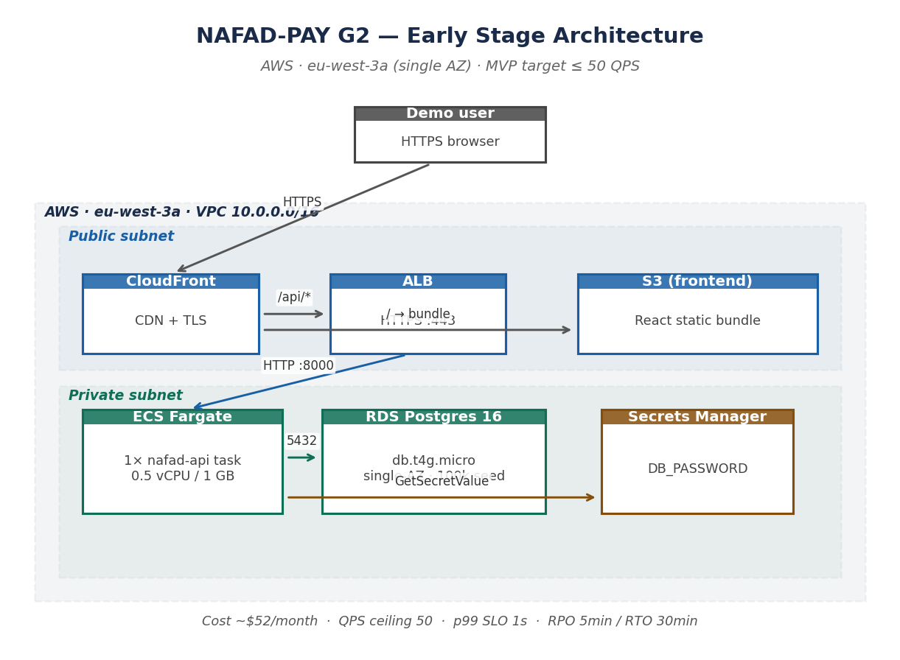

# Architecture — Early Stage (MVP)

**Owner:** M4 · **Status:** TEMPLATE — fill in each section.

> This document follows the mandatory 7-section template from
> `PROJET_NAFAD_PAY.html` section 3.1. Section 6 (Migration plan) is omitted —
> it appears only in `architecture-at-scale.md`.

---

## 1. Context & constraints

| | |
|---|---|
| Target throughput | ≤ 50 QPS (vs measured peak ≈ 8 tx/s, 6× margin) |
| Data volume | < 1 M rows |
| Active users | ~5 k |
| Region | AWS eu-west-3 (Paris) |
| Availability zone | Single AZ — eu-west-3a |
| RPO | 5 minutes (daily snapshots + WAL archives) |
| RTO | 30 minutes |
| Budget | MVP — minimise cost |
| Compliance | None for MVP (no KYC/AML yet) |

Numbers from `eda/numbers-cheatsheet.md`: p50 latency 233 ms, p99 ≈ 4 s, failure
rate 32.7 %, peak ~8 tx/s.

## 2. C4 diagram



**Level 1 — System context.** G2 connects to: end users (browser), G1's OLTP
database (read), G3's data lake (downstream consumer of our writes via CDC).

**Level 2 — Containers** (this Early Stage):
- 1× ECS Fargate task running the FastAPI backend behind 1× Application Load Balancer
- React bundle on S3 + CloudFront (eu-west-3 origin)
- 1× RDS PostgreSQL single-AZ (db.t4g.micro)
- AWS Secrets Manager for the DB credentials
- CloudWatch Logs for stdout

Single VPC `10.0.0.0/16`, public subnet `10.0.1.0/24` (ALB), private subnet
`10.0.2.0/24` (ECS + RDS), all in AZ `eu-west-3a`.

## 3. Architecture decisions (ADR-lite)

### ADR-1 · Compute: ECS Fargate vs Lambda
- **Decision**: ECS Fargate (1 task, 0.5 vCPU / 1 GB).
- **Alternatives considered**: AWS Lambda + API Gateway, EC2 self-managed.
- **Why**: steady traffic favours a long-running container — no cold-start
  penalty on each request, simpler model for HTTP APIs with persistent DB
  connection pools.

### ADR-2 · Database: RDS vs self-managed Postgres on EC2
- **Decision**: RDS PostgreSQL 16 single-AZ.
- **Alternatives considered**: Postgres on EC2, Aurora Serverless v2.
- **Why**: RDS gives automated backups, minor version upgrades, easy Multi-AZ
  migration path. Aurora is overkill at MVP scale and has cold-start latency.

### ADR-3 · Frontend hosting: S3 + CloudFront vs container-served
- **Decision**: S3 bucket + CloudFront distribution.
- **Alternatives considered**: nginx container behind ALB, ECS-served frontend.
- **Why**: static assets belong on a CDN. ~$1/month for S3+CloudFront vs ~$30
  for a permanent ECS task. Better latency for users in Mauritania via global
  edge cache.

### ADR-4 · Secrets: Secrets Manager vs Parameter Store
- **Decision**: AWS Secrets Manager.
- **Alternatives considered**: SSM Parameter Store SecureString, hardcoded `.env`.
- **Why**: native rotation API ready for At Scale, $0.40/secret/month is
  acceptable, retrieval cached by AWS SDK.

## 4. Critical data flows

### Happy path: `POST /transactions`

```
Browser ──HTTPS──► CloudFront ──► ALB ──► ECS Fargate ──► RDS Postgres
                                            │
                                            └─► [idempotency check:
                                                 SHA256 body hash + dedupe table]
```

See `docs/idempotency-implementation.md` for the full algorithm. Round-trip
latency budget: 50 ms ALB + 200 ms p50 application + 20 ms DB = ~270 ms.

### Retry / timeout

If the client receives a 5xx or times out, it retries with the **same**
`Idempotency-Key`. The second request short-circuits at step 2 of the
idempotency check and returns the cached response — no duplicate row.

## 5. Known breaking points

- At ~50 QPS the single Fargate task saturates CPU.
- At 80 % connection pool usage on RDS (default 20 connections), `POST /transactions`
  starts queueing.
- RDS storage burst credits exhaust under sustained writes.

**Triggers to migrate to At Scale:**
- p99 latency > 500 ms sustained for 5 minutes
- RDS CPU > 70 %
- Connection pool usage > 80 %
- Daily transaction volume > 200 k

## 7. Top 3 risks

| # | Risk | Likelihood | Impact | Mitigation |
|---|---|---|---|---|
| 1 | Single-AZ outage (eu-west-3a unavailable) | Low | High | Tested restore from snapshot to a different AZ; documented runbook |
| 2 | `.env` secret leak via accidental commit | Medium | High | `.gitignore` enforced; production uses Secrets Manager only; pre-commit hook to scan for secrets |
| 3 | No API auth in MVP — public ALB endpoint | High | Medium | ALB only accepts requests with custom CloudFront origin header (`X-CloudFront-Secret`) |

---

## Appendices

### A. Cost estimate (monthly, USD)

| Component | Cost |
|---|---|
| ECS Fargate (1 task, 24/7) | ~15 |
| ALB | ~22 |
| RDS db.t4g.micro single-AZ | ~13 |
| S3 (small) | ~1 |
| CloudFront | ~1 |
| Secrets Manager (1 secret) | 0.40 |
| CloudWatch Logs | ~3 |
| Data transfer | ~5 |
| **Total** | **~60/month** |

### B. References

- M1's idempotency implementation: `docs/idempotency-implementation.md`
- M3's EDA numbers: `eda/numbers-cheatsheet.md`
- M4's actual deployment ARNs: `docs/deployment-notes.md`
- Master document: `PROJET_NAFAD_PAY.html` sections 3.1, 3.2
