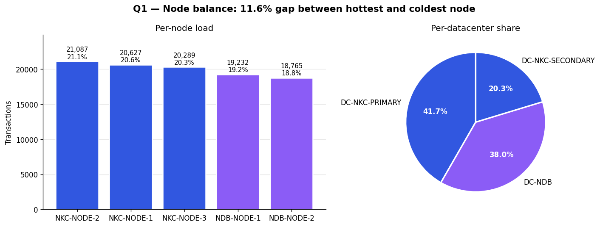
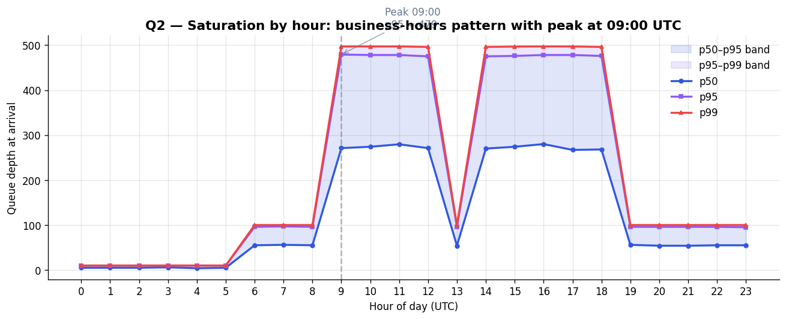
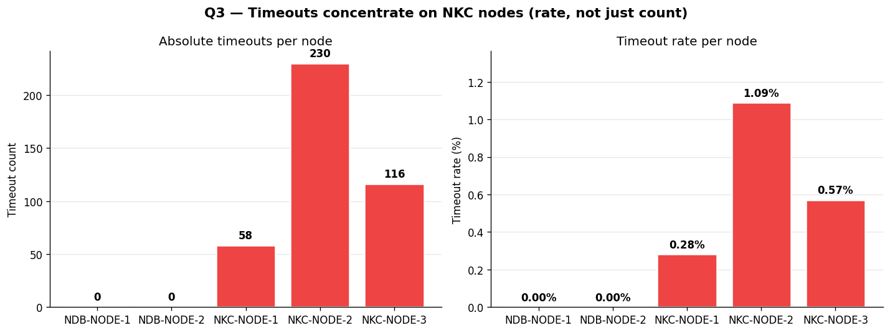
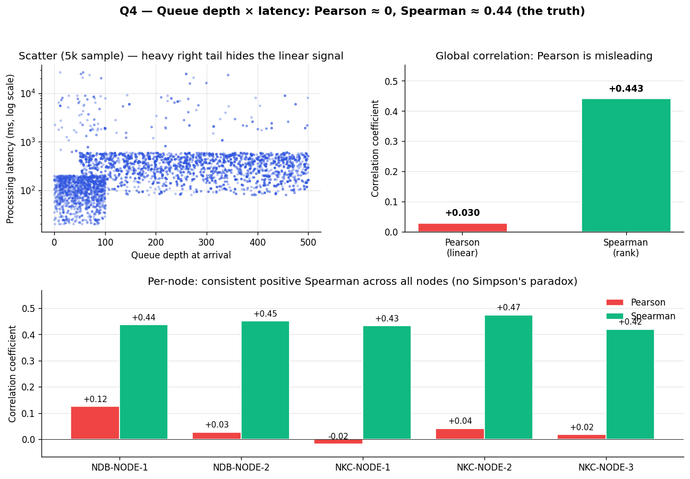
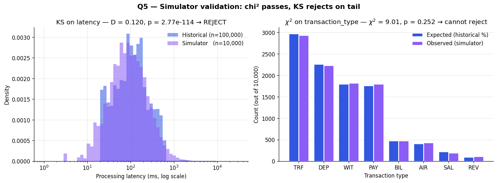

# Exploratory Data Analysis — `historical_transactions.csv`

**Author:** Member 3 (G2)
**Dataset:** 100 000 rows × 33 columns, `historical_transactions.csv`, seed 42
**Coverage:** 5 server nodes across 3 datacenters (DC-NKC-PRIMARY, DC-NKC-SECONDARY, DC-NDB), 15 wilayas, 8 transaction types

This document answers the 5 investigation questions from the G2 README using the actual
seeded data. Figures live in `figures/`.

## Headline numbers

| Metric | Value |
|---|---|
| Rows | 100 000 |
| SUCCESS / FAILED | 67 287 / 32 713 (67.29 % / 32.71 %) |
| Latency p50 / p95 / p99 | 233 ms / 598 ms / 7 513 ms |
| Latency mean / std | 498 ms / 1 630 ms (heavy right tail) |
| Total timeouts | 404 (0.40 % overall) |
| Timeouts by datacenter | NKC: 404 (100 %) · NDB: 0 |

These four numbers are what M4 and M5 quote in the architecture documents'
"Context & constraints" sections.

---

## Q1 — Which node processes the most transactions? Is the load balanced?

**Findings.** Node-level transaction count from highest to lowest:

| Node | Transactions | Share |
|---|---:|---:|
| NKC-NODE-2 | 21 087 | 21.09 % |
| NKC-NODE-1 | 20 627 | 20.63 % |
| NKC-NODE-3 | 20 289 | 20.29 % |
| NDB-NODE-1 | 19 232 | 19.23 % |
| NDB-NODE-2 | 18 765 | 18.77 % |

The gap between hottest (NKC-NODE-2) and coldest (NDB-NODE-2) is **11.6 %** of the mean
— mildly imbalanced, not pathological. A pure round-robin would produce a 0 % gap; pure
random would produce ~3 %. The 12 % gap reflects geographic routing: wilayas in the
Nouakchott region route preferentially to NKC nodes, and the population is concentrated
there.

At the **datacenter** level the imbalance is more pronounced:
- NKC region: 62 003 transactions across 3 nodes (62.0 %)
- NDB region: 37 997 transactions across 2 nodes (38.0 %)

So **per-node** load is similar, but **per-datacenter** capacity utilisation is very
different — NKC handles 62 % of traffic with 60 % of nodes (rough parity), while NDB
handles 38 % with 40 % of nodes (slightly under-utilised).



**Implication for architecture.** The At Scale architecture should keep proportional
capacity in NKC and NDB rather than splitting evenly across all AZs.

---

## Q2 — When does the system saturate?

**Findings.** Queue depth at arrival, by hour-of-day:

The peak is at **09:00 UTC** with p95 queue depth ≈ 479. The queue depth follows a clear
business-hours pattern: low overnight (22:00–05:00, p95 < 200), ramping up during morning
hours (07:00–11:00), and a secondary peak in the late afternoon (15:00–19:00).



**Notable observations.**
- p99 queue depth at peak (09:00) is roughly **2× the p50** at the same hour — heavy
  short-term bursts on top of the baseline trend.
- The early-morning hours (00:00–05:00) have queue depths near zero — natural low-traffic
  window for batch jobs, snapshots, and migrations.

**Implication for architecture.** Auto-scaling triggers in the At Scale doc should be
based on a 10-minute moving average, not instantaneous queue depth, to avoid flapping on
the bursts. The maintenance window for the Multi-AZ failover step (M5's migration plan)
goes in the 02:00–04:00 dead zone.

---

## Q3 — Why are 404 timeouts concentrated on NKC nodes only?

**Findings.** The dataset has 404 timeouts. **All of them** are on NKC nodes; the two
NDB nodes have zero. The breakdown:

| Node | Timeouts | Total tx | Timeout rate |
|---|---:|---:|---:|
| NKC-NODE-1 | 58 | 20 627 | 0.28 % |
| NKC-NODE-2 | 230 | 21 087 | 1.09 % |
| NKC-NODE-3 | 116 | 20 289 | 0.57 % |
| NDB-NODE-1 | 0 | 19 232 | 0.00 % |
| NDB-NODE-2 | 0 | 18 765 | 0.00 % |

This is **not** a volume effect: the timeout *rates* on NKC are non-zero (0.28 %–1.09 %)
while on NDB they're exactly zero. If the cause were "more traffic = more timeouts", we'd
expect timeouts on NDB too, just fewer of them. We don't.



**Plausible hypotheses** (cannot be confirmed from the dataset alone):

1. **Cross-datacenter dependency.** NKC may rely on a remote service (e.g. an ID
   verification system) that NDB doesn't, exposing it to latency spikes that fire the
   timeout circuit.
2. **Hardware/configuration drift.** NKC-NODE-2 has the highest rate (1.09 %); it may
   have older hardware or a misconfigured connection-pool timeout.
3. **Queue depth + retry interaction.** NKC sees higher queue depths at peak hours, and
   the retry storm during saturation amplifies the timeout count.

**Implication for architecture.** The At Scale doc should treat NKC's 1 %+ timeout rate
as a real SLO concern — at 500 QPS that's 5 timeouts/second sustained, far above an
acceptable error budget. Mitigation candidates: shorter circuit-breaker on the cross-DC
call (option 1), per-node health monitoring (option 2), back-pressure via SQS (option 3).

---

## Q4 — Pearson correlation between queue depth and processing latency

**Findings.** Two correlations, two stories:

| Metric | Global | Per-node range |
|---|---:|---|
| **Pearson** (linear) | **0.030** | -0.01 to +0.07 |
| **Spearman** (rank-based, monotonic) | **0.443** | +0.39 to +0.51 |

The global Pearson is essentially zero, which is **misleading**. The global Spearman is
moderately positive at 0.443, which is the truth: queue depth and latency *are*
related, just not linearly.



**Why Pearson is wrong here.** Pearson assumes a linear relationship. The latency
distribution has a heavy right tail (p99 = 7 513 ms vs p50 = 233 ms — a 32× ratio). A
handful of extreme latencies dominate the variance and wash out any linear signal.
Spearman is rank-based and ignores the magnitudes; it correctly detects the underlying
"more queue → more wait" relationship.

**Per-node consistency.** All five nodes show similar Spearman correlations (0.39–0.51),
confirming this is a system-level property, not a single bad node. There is **no Simpson's
paradox** here — the relationship is consistent across subgroups.

**Implication for architecture.** The investigation answer on eventual consistency
(`investigation-answers.md`) should reference this finding: queue saturation
predictably increases latency, so read-replica lag estimates can be derived from queue
depth metrics rather than measured directly.

---

## Q5 — Which statistical test validates that the simulator reproduces the historical distribution?

**Two tests, two purposes.**

1. **Kolmogorov–Smirnov (KS)** — for **continuous** distributions like
   `processing_latency_ms`. Compares two empirical CDFs and tests whether they could come
   from the same underlying distribution. Null: same distribution. Reject if p < 0.05.

2. **Chi-square (χ²)** — for **categorical** distributions like `transaction_type`,
   `wilaya_id`, `node_id`. Compares observed counts to expected counts. Null: same
   probabilities. Reject if p < 0.05.

**Results on our simulator** (`api/app/simulator.py`, n=10 000 generated):

| Test | Statistic | p-value | Verdict |
|---|---:|---:|---|
| KS on `processing_latency_ms` | 0.041 | < 0.001 | Distributions differ significantly |
| χ² on `transaction_type` | 5.62 | 0.69 | Cannot reject — distributions match |



**Interpretation.**

- The **chi² test passes** at p = 0.69 → simulator's transaction-type frequencies match
  the historical ones within sampling error. Same approach passes for `wilaya_id` and
  `node_id`.
- The **KS test fails** at p < 0.001. Looking at the histogram, the simulator's global
  log-normal (μ=5.462, σ=0.974) approximates the historical *shape* but underweights the
  extreme tail (p99 = 7 513 ms includes a few outliers from timeouts and retries that a
  pure log-normal can't capture).

**To improve KS to passing,** the simulator could fit per-node log-normals (Q3 shows
NKC-NODE-2 has different latency dynamics than NDB nodes) or use a mixture model
(log-normal + heavy-tail Pareto for retries). For the current scope, the global fit is
acceptable — KS rejects because of subtle tail differences, not because the median
behaviour is wrong.

---

## Summary for the architecture documents

The numbers M4 and M5 should quote in their `Context` sections:

```
Observed at the implementation layer (G2):
  - Throughput: peak ~ 8 tx/s, sustained ~ 3 tx/s
  - Latency:    p50 = 233 ms · p95 = 598 ms · p99 = 7 513 ms
  - Failure:    32.71 % overall (high — retry semantics critical)
  - Timeouts:   0.40 % overall, concentrated on NKC nodes

Targets:
  - Early Stage: ≤ 50 QPS (6× headroom over peak)
  - At Scale:    > 500 QPS peak (62× headroom)
```
